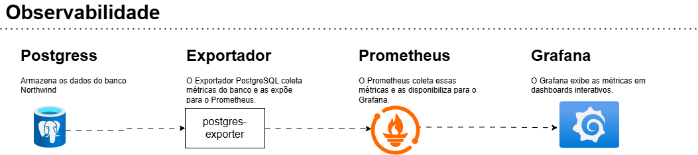

# Projeto de Observabilidade

Este projeto configura uma stack de observabilidade usando Docker, que inclui um banco de dados PostgreSQL, um exportador de métricas para PostgreSQL, o Prometheus para monitoramento e o Grafana para visualização. O objetivo é fornecer uma solução completa para monitorar a saúde e o desempenho do banco de dados PostgreSQL.

## Fluxo do Projeto

Abaixo está o diagrama representando o fluxo do projeto:



## Estrutura do Projeto

Abaixo está a estrutura de pastas do projeto:

```
ObservabilidadeBancoDados/
├── db/
│   ├── Dockerfile
│   ├── northwind.sql
│   └── README.md
├── postgres-exporter/
│   ├── Dockerfile
│   └── README.md
├── prometheus/
│   ├── Dockerfile
│   ├── prometheus.yml
│   └── README.md
├── grafana/
│   ├── Dockerfile
│   ├── dashboards/
│   │   └── example-dashboard.json
│   ├── provisioning/
│   │   ├── datasources/
│   │   │   └── datasource.yml
│   │   └── dashboards/
│   │       └── dashboard.yml
│   └── README.md
├── docker-compose.yml
└── README.md
```

## Começando

Para configurar e executar toda a stack de observabilidade, siga os passos abaixo:

1. **Clone o repositório**:
   ```bash
   git clone https://github.com/AleTavares/ObservabilidadeBancoDados.git
   cd observability-project
   ```

2. **Construa e execute os serviços**:
   ```bash
   docker-compose up --build -d
   ```

3. **Acesse os serviços**:
   - PostgreSQL: Conecte-se ao banco de dados usando o cliente de sua preferência.
   - Prometheus: Acesse a interface do Prometheus em `http://localhost:9090`.
   - Grafana: Acesse a interface do Grafana em `http://localhost:3000` (as credenciais padrão são `admin`/`admin`).

## Configuração do Grafana

O Grafana é usado para visualizar as métricas coletadas pelo Prometheus. Após iniciar o serviço Grafana, siga os passos abaixo para configurar e importar o dashboard:

1. Acesse o Grafana em `http://localhost:3000`.
2. Faça login com as credenciais padrão:
   - **Usuário:** `admin`
   - **Senha:** `admin` (você será solicitado a alterar a senha no primeiro login).
3. Clique no ícone "+" na barra lateral esquerda e selecione "Importar".
4. No campo "Importar via ID do Dashboard", insira o ID do dashboard desejado. Por exemplo:
   - **ID do Dashboard:** `9628`.
5. Clique em "Carregar".
6. Selecione a fonte de dados Prometheus configurada e clique em "Importar".

Agora o dashboard estará disponível para monitorar as métricas do banco de dados PostgreSQL.

## Informações Adicionais

- Cada serviço possui seu próprio arquivo README com instruções detalhadas de configuração e uso.
- O banco de dados Northwind é pré-carregado no PostgreSQL para testes e demonstrações.
- Modifique a configuração do Prometheus em `prometheus/prometheus.yml` para personalizar a coleta de métricas, se necessário.

Este projeto tem como objetivo fornecer uma solução robusta de observabilidade para monitorar bancos de dados PostgreSQL, facilitando o acompanhamento de desempenho e a resolução de problemas.